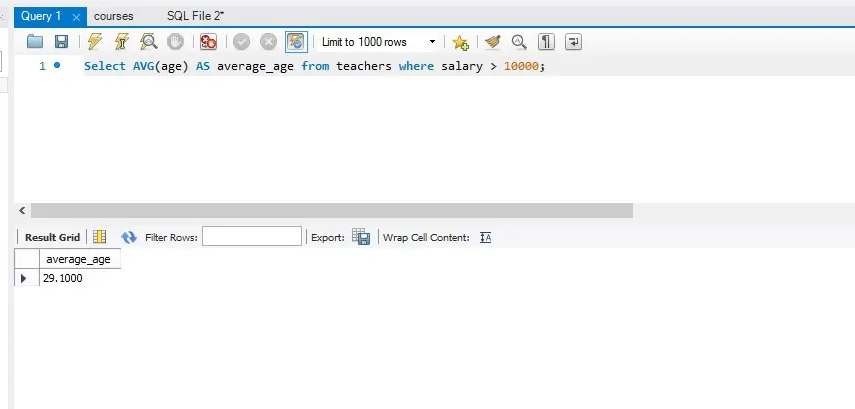
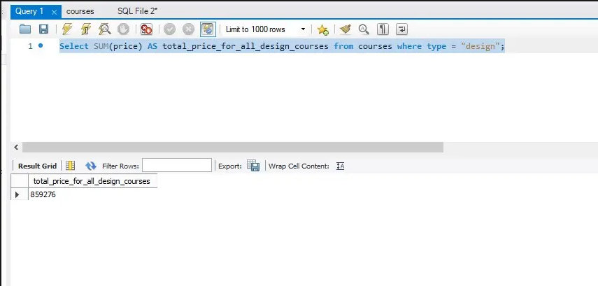
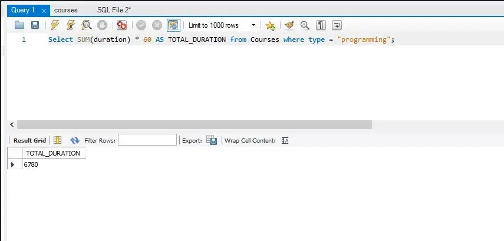

# Примеры запросов SQL

## Задание №2 — Функции и выражения, агрегация данных

1. Написать запрос для выбора среднего возраста всех учителей с зарплатой более 10 000.

2. Написать запрос для расчета суммы, сколько будет стоить купить все курсы по дизайну.

3. Написать запрос для расчёта, сколько минут (!) длятся все курсы по программированию.

## Решение:

### 1.

**Select AVG(age) AS average_age from teachers where salary > 10000;**

Результат выполнения запроса:

### 2.

**Select SUM(price) AS total_price_for_all_design_courses from courses where type = "design";**

Результат выполнения запроса:

### 3.

**Select SUM(duration) * 60 AS TOTAL_DURATION from Courses where type = "programming";**

Результат выполнения запроса:
