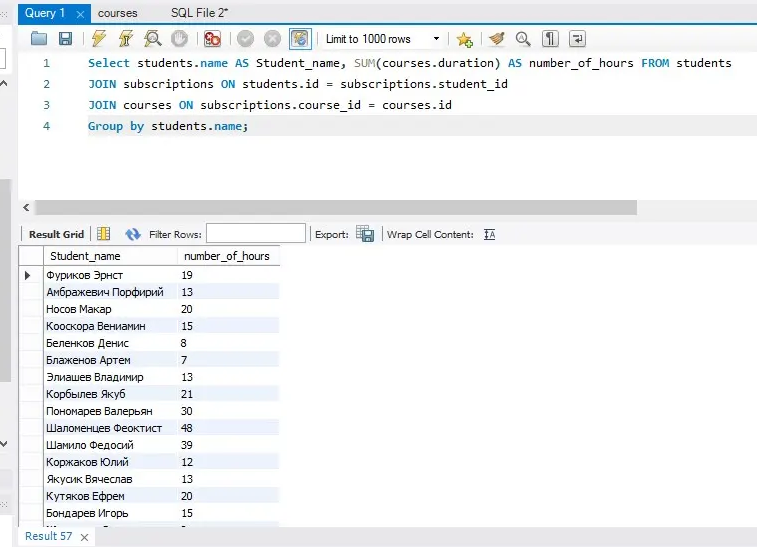
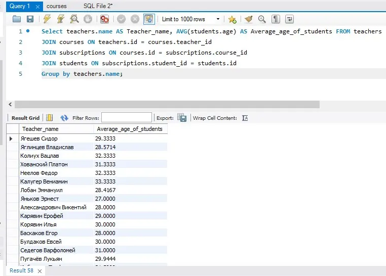
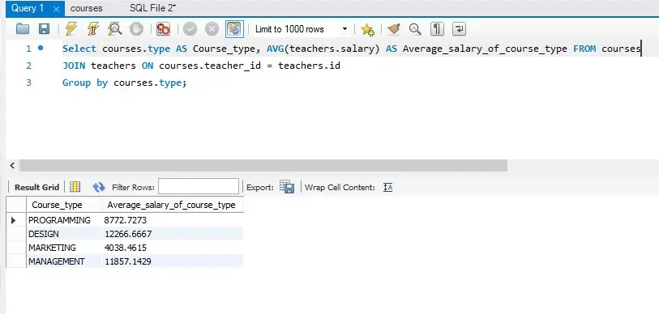

# Примеры запросов SQL

## Задание №3 — Группировка, соединение таблиц (JOIN)

1. Напишите запрос, который выводит сумму, сколько часов должен в итоге проучиться каждый студент (сумма длительности всех курсов на которые он подписан).  
В результате запрос возвращает две колонки: Имя Студента — Количество часов.

2. Напишите запрос, который посчитает для каждого учителя средний возраст его учеников.  
В результате запрос возвращает две колонки: Имя Учителя — Средний Возраст Учеников.

3. Напишите запрос, который выводит среднюю зарплату учителей для каждого типа курса (Дизайн/Программирование/Маркетинг и т.д.).  
В результате запрос возвращает две колонки: Тип Курса — Средняя зарплата.

## Решение:

### 1.

**Select students.name AS Student_name, SUM(courses.duration) AS number_of_hours FROM students  
JOIN subscriptions ON students.id = subscriptions.student_id   
JOIN courses ON subscriptions.course_id = courses.id  
Group by students.name;**

Результат выполнения запроса:

### 2.

**Select teachers.name AS Teacher_name, AVG(students.age) AS Average_age_of_students FROM teachers  
JOIN courses ON teachers.id = courses.teacher_id  
JOIN subscriptions ON courses.id = subscriptions.course_id  
JOIN students ON subscriptions.student_id = students.id  
Group by teachers.name;**

Результат выполнения запроса:

### 3.

**Select courses.type AS Course_type, AVG(teachers.salary) AS Average_salary_of_course_type FROM courses  
JOIN teachers ON courses.teacher_id = teachers.id  
Group by courses.type;**

Результат выполнения запроса:

