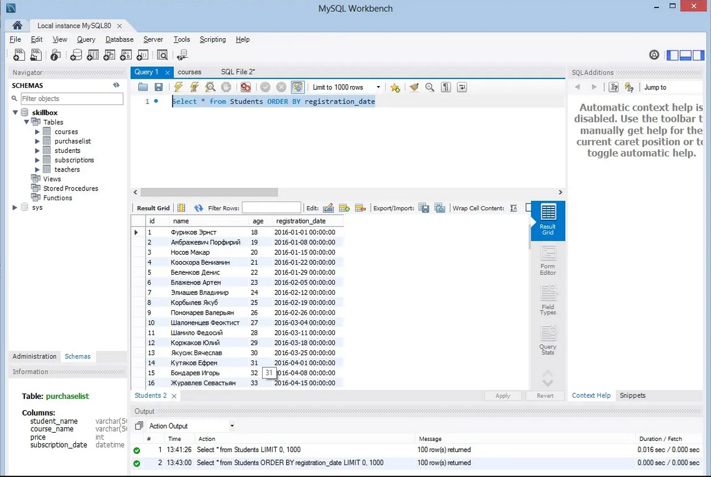
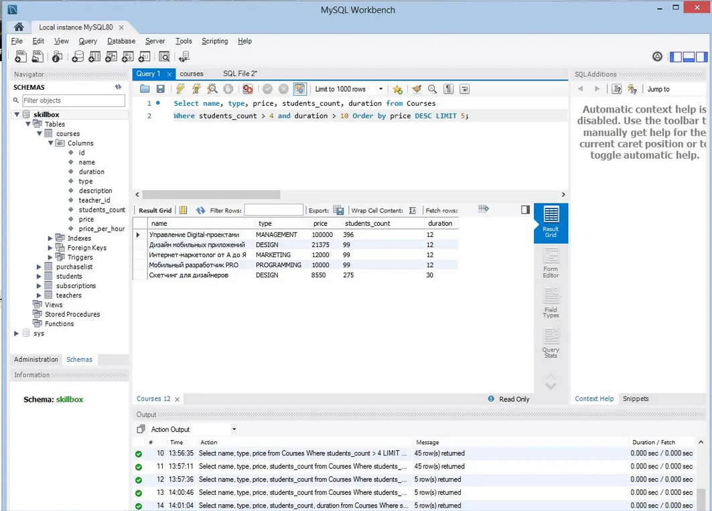
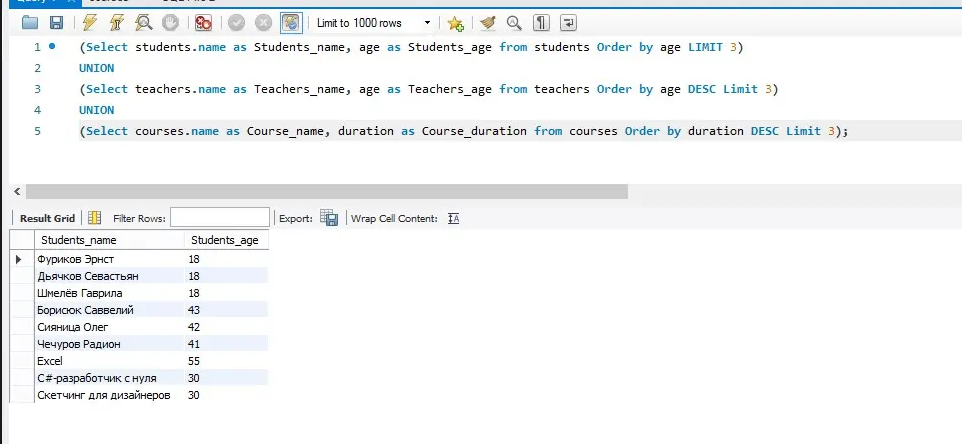

# Примеры запросов SQL

## Задание №1 — Выбор и фильтрация данных, запрос SELECT 

1. Написать запрос для выбора студентов в порядке их регистрации.

2. Написать запрос для выбора 5 самых дорогих курсов, на которых более 4 студентов, и которые длятся более 10 часов.

3. Написать один (!) запрос, который выведет одновременно список из имён трёх самых молодых студентов, имён трёх самых старых учителей и названий трёх самых продолжительных курсов.

## Решение:

### 1.

**Select * from Students ORDER BY registration_date**

Результат выполнения запроса:

### 2.

**Select name, type, price, students_count, duration from Courses  
Where students_count > 4 and duration > 10 Order by price DESC LIMIT 5;**

Результат выполнения запроса:

### 3.

**(Select students.name as Students_name, age as Students_age from students Order by age LIMIT 3)  
UNION  
(Select teachers.name as Teachers_name, age as Teachers_age from teachers Order by age DESC Limit 3)  
UNION  
(Select courses.name as Course_name, duration as Course_duration from courses Order by duration DESC Limit 3);**

Результат выполнения запроса:
